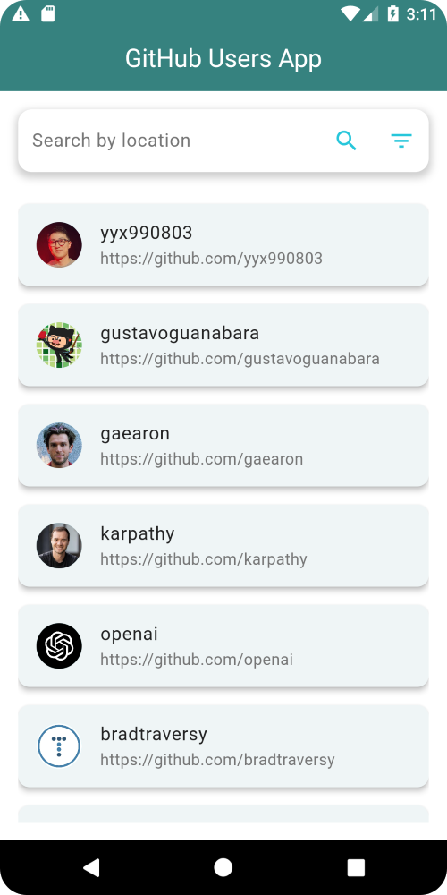

# GITHUB USERS APP

## Project Description

The purpose of the GitHub Users App is to allow users to view GitHub profiles from different countries and explore individual user profiles. The app is designed to offer a smooth and easy user experience for browsing and sharing GitHub profiles.

## Introduction

The GitHub Users App enables users to search for GitHub users based on their location or username and view their profiles. Users can also share these profiles via social media, making it easier to showcase developers' work and connect with others.

## Features

- Search for GitHub users by country.
- Search for specific GitHub users by name.
- View detailed profiles of GitHub users.
- Share user profiles via social media apps.

## Getting Started

### Prerequisites

Make sure you have the following software and tools installed:

- [Flutter SDK](https://flutter.dev/docs/get-started/install)
- [Android Studio](https://developer.android.com/studio) or [Visual Studio Code](https://code.visualstudio.com/)
- Any other dependencies listed below.

#### Dependencies

```yaml
dependencies:
  flutter:
    sdk: flutter
  share_plus: ^4.0.0
  device_apps: ^2.2.0
  connectivity: ^3.0.1
  url_launcher: ^6.0.20
  infinite_scroll_pagination: ^4.0.0
```

### Installation

Follow these steps to install and run the project locally:

1. Clone the repository:
   ```sh
   git clone https://github.com/Vaniahchristian/GITHUBAPP.git
   ```
2. Navigate to the project directory:
   ```sh
   cd GITHUBAPP
   ```
3. Install the necessary dependencies:
   ```sh
   flutter pub get
   ```

### Running the App

To run the app on an emulator or physical device:

1. Ensure your emulator or device is connected and set up.
2. Run the app:
   ```sh
   flutter run
   ```

## Usage

Once the app is running, users can:

- Search for GitHub users by selecting a country or entering a username in the search bar.
- Tap on a user’s name to view their detailed profile.
- Share profiles with others using the share feature integrated into the app.

## Screenshots

Here are some screenshots to showcase the features and UI of the app:




## Contributing

If you'd like to contribute to this project, please follow these guidelines:

1. Fork the repository.
2. Create a new feature branch:
   ```sh
   git checkout -b feature/AmazingFeature
   ```
3. Commit your changes:
   ```sh
   git commit -m 'Add some AmazingFeature'
   ```
4. Push to the branch:
   ```sh
   git push origin feature/AmazingFeature
   ```
5. Open a pull request.


## Contact

My contact information for users or contributors to reach out.

- Email: vierycalliper@gmail.com
- GitHub: [VaniahChristian](https://github.com/Vaniahchristian)
